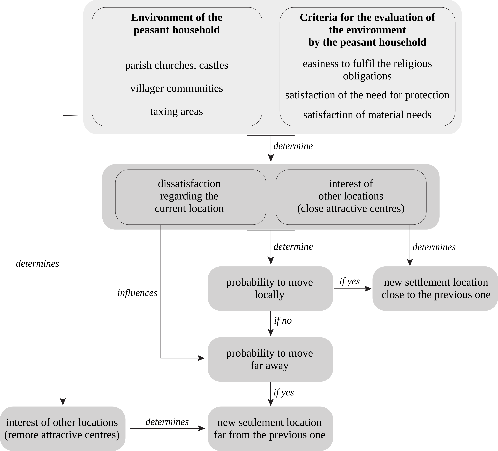

# SimFeodal
## Agent-based modelling to explore the combined effects of social and demographic changes on rural settlement patterns in North-Western Europe during the Middle Ages (800 CE to 1100 CE)

**The agent-based model SimFeodal simulates the emergence of enduring population clusters located around the castles and the churches in a rural region during the Middle Ages.**  In the course of time, population clusters (hamlets, villages, small towns) become more numerous; many of them grow (i. e. their number of peasant households increases) but some clusters grow more than others.

### Historical context

Around 800 CE, the Carolingian Empire achieved its greatest territorial extent: it covered a large part of Europe, from the Ebro to the Elbe. At a regional scale, settlement patterns mixed small dispersed villages (which corresponded to a loose gathering of few houses) and isolated farms (i. e. agricultural holdings). Villages and farms were not permanent: their location often changed (every one or two centuries) from about tens meters to several hundred meters. At this time period, towns were inherited from the Antiquity. They had a central function as episcopal see but their economic and administrative role was not really important.

Around 1100 CE, regional settlement patterns are composed of enduring population clusters located around the castles and the churches. Population clusters (hamlets, villages, towns) are much more numerous than in 800 CE. Towns that were existing in 800 CE are much larger since they have created productive and commercial activities; new nuclei have emerged around suburban monasteries. Many small towns have emerged; they are most often associated to priories having their own outer wall.

Thus regional settlements patterns that were dispersed in 800 CE became much more concentrated and hierarchical in 1100 CE. This phenomenon occured in all regions in North-Western Europe 800 CE to 1100 CE but the intensity of the concentration and the hierarchisation of the settlement pattern can be notably variable across the regions.

Several processes jointly explain this major transition.

* The piecemeal dismantling of the Carolingian Empire and the dissipation of powers induced  struggles among lords and thus a rise in violence, even increased by Viking invasions. The result of this was the creation of castles as well as an increase of the need of protection for peasant households;

* The so-called "feudal revolution" of the 11th century during which ever smaller lords appropriated various administrative, fiscal and judicial rights for themselves and their vassals. The need of lords for money was largely created by the militarisation of the society mentioned above. As a result, usage fees and rents paid by peasant households to the lords increased a lot.

* The increase of the religious control of the society from which resulted a great upwelling of piety and level of devotion, an increase of the number of parish churches and the increase of usage fees and rents paid by peasant households to the Church.

* The creation of villager communities by peasant households to increase their productivity and counterbalance the power of lords.

### Modelled entities

| Name  | Description | Type  | Activity | Level |
| ------------- | ------------- | ------------- | ------------- | ------------- |
| Peasant households | Most of them can move locally and at long distances but others are so highly dependent on their lord that they can not leave his grounds| Socio-spatial | Active | Micro-geographic |
| Lords  | Liege lords and small lords (enfeoffed vassal, knight...) do not have the same behaviour rules | Social | Active | Micro-geographic |
| Taxing areas  | Each taxing area refers to only one of the following types of rights: rents, high justice rights, medium and low justice rights, usage rights | Spatial | Passive | Micro-geographic |
| Attractive points  | Three types of attractive points are distinguised: parish churches, castles, and villager communities  |  Socio-spatial | Active | Micro-geographic |
| Population clusters  | Villages, towns. They are defined as the aggregation of neighbouring peasant households and attractive points |  Spatial | Passive | Meso-geographic |
| Attraction centres  | They are defined as the aggregation of neighbouring attractive points |  Spatial | Passive | Meso-geographic |

### Relocation process of a peasant household within SimFeodal

